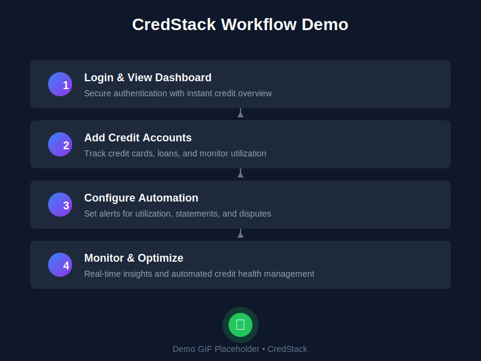
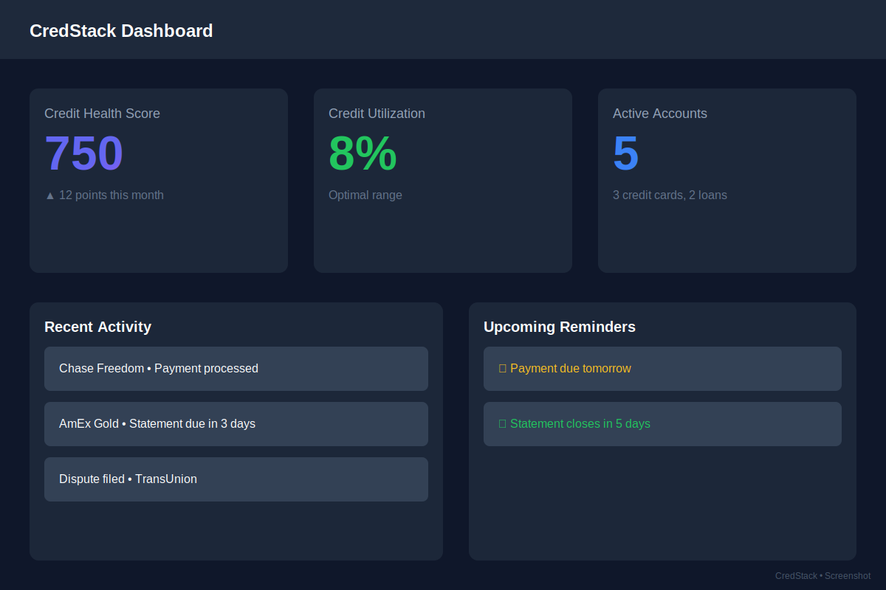
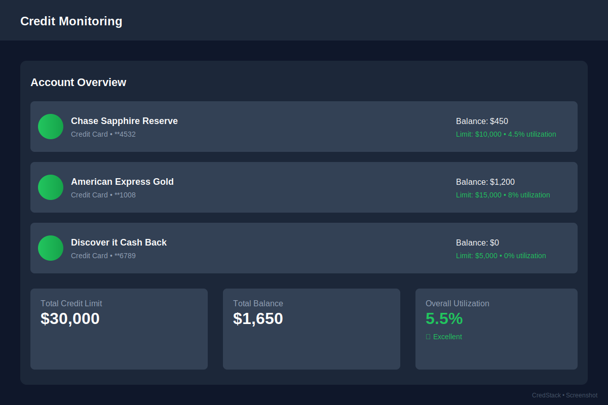
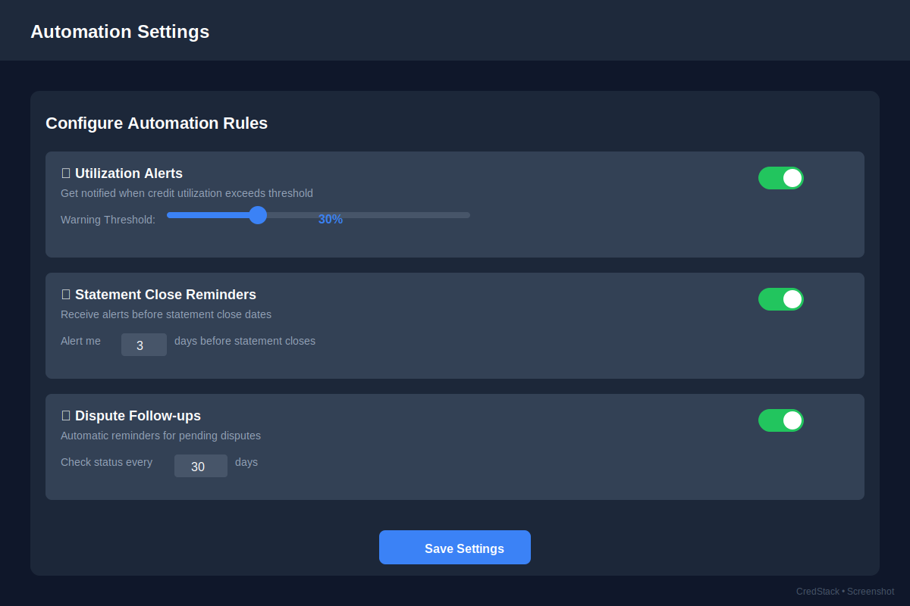
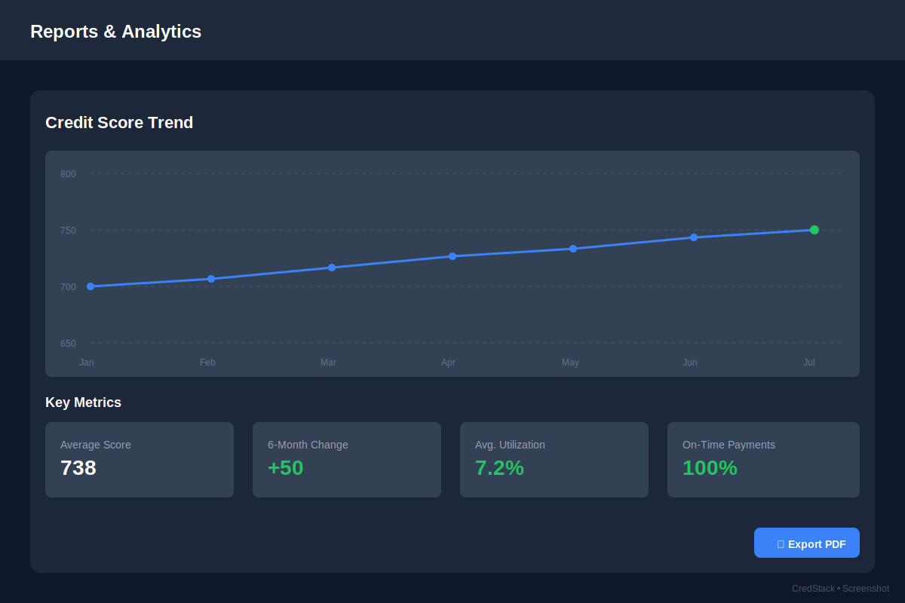

# CredStack: Production-Ready Credit Optimization Platform 🛡️

> **"Stop guessing, start automating."**

[](https://github.com/WADELABS/Credit-Worthy/actions)
[](https://www.python.org/downloads/)
[](LICENSE)

CredStack is a precision-engineered, production-ready platform for automated credit optimization. Moving beyond simple tracking, it provides enterprise-grade authentication, comprehensive API access, and robust automation to maximize your credit health while maintaining absolute data sovereignty.

## 🌐 Live Demo

> **[View Live Demo](https://credstack-demo.onrender.com)** *(coming soon)*

Experience CredStack's powerful features with a live demo deployment. Test the full functionality including credit monitoring, automation rules, and real-time analytics.

## 🎥 Demo

Get a quick overview of CredStack's workflow:

<p align="center">
  
</p>

**Quick Workflow:**
1. 🔐 **Login** - Secure authentication with your credentials
2. 💳 **Add Accounts** - Track credit cards and monitor utilization
3. ⚙️ **Configure Automation** - Set up alerts and reminders
4. 📊 **Monitor & Optimize** - Real-time credit health insights

## 📸 Screenshots

### Dashboard Overview


*Main dashboard displaying your credit health score, current utilization, active accounts, recent activity, and upcoming reminders.*

### Credit Monitoring


*Comprehensive view of all credit accounts with real-time balance tracking, credit limits, and utilization percentages.*

### Automation Settings


*Configure intelligent automation rules for utilization alerts, statement reminders, and dispute follow-ups.*

### Reports & Analytics


*Visualize your credit score trends over time with detailed analytics and exportable reports.*

## ✨ What's New

### 🔐 Enterprise Security
- **Password-based authentication** with bcrypt hashing
- **JWT token support** for API access
- **Rate limiting** and account lockout protection
- **CSRF protection** on all forms
- **Security headers** (HSTS, X-Frame-Options, etc.)

### 🚀 RESTful API (v1)
- Complete REST API with JWT authentication
- Endpoints for credit data, automation, disputes, and user management
- Rate limiting and comprehensive error handling
- Full API documentation available

### 🧪 Production-Ready Testing
- 70+ comprehensive tests covering:
  - Authentication flows
  - API endpoints
  - Input validation
  - SQL injection prevention
  - XSS prevention
  - Data isolation
- CI/CD pipeline with automated testing

### 📚 Complete Documentation
- **API Documentation** - Full REST API reference
- **Contributing Guidelines** - Development best practices
- **Changelog** - Version history and migration guide

## 🏛️ Architectural Ethos

CredStack operates as an active automation substrate that employs heuristic logic to manage credit utilization before it impacts your financial profile.

### 🧠 Utilization Management Heuristics
- **Proactive Signals**: Alerts triggered before statement close dates
- **Configurable Thresholds**: Target <10% utilization for optimal credit scores
- **Automated Workflows**: Reduce reported balances to maintain credit health

### 🛡️ Privacy Architecture & Data Sovereignty
- **Local-Only Storage**: SQLite database at `database/credstack.db`
- **Zero-Cloud Footprint**: No external APIs or third-party telemetry
- **Hermetic Execution**: All processing runs locally on your hardware
- **Multi-User Support**: Complete data isolation between users

## 🚀 Quick Start

### Prerequisites
- Python 3.8 or higher
- pip (Python package manager)

### Installation

1. **Clone the repository**
   ```bash
   git clone https://github.com/WADELABS/Credit-Worthy.git
   cd Credit-Worthy
   ```

2. **Install dependencies**
   ```bash
   pip install -r requirements.txt
   ```

3. **Configure environment**
   ```bash
   cp .env.example .env
   # Edit .env with your settings (SECRET_KEY, JWT_SECRET_KEY)
   ```

4. **Initialize database**
   ```bash
   python setup.py
   ```

5. **Run migrations (for existing databases)**
   ```bash
   python migrations/001_add_password_fields.py
   python migrations/002_enhance_disputes.py
   ```

6. **Start the application**
   ```bash
   python app.py
   ```

7. **Access the dashboard**
   Open your browser to `http://localhost:5000`

### First Time Setup

1. Navigate to `http://localhost:5000`
2. Click "Register here" to create an account
3. Enter your email, password, and name
4. You'll be automatically logged in to your dashboard

## 📋 Features

### Dashboard
- **Credit Health Score**: Real-time credit score calculation
- **Account Management**: Track credit cards, loans, and other accounts
- **Utilization Monitoring**: Automatic utilization percentage calculations
- **Active Disputes**: Track disputes with credit bureaus
- **Upcoming Reminders**: Never miss important dates

### Automation
- **Statement Alerts**: Notifications before statement close dates
- **Utilization Tracking**: Monitor credit utilization automatically
- **Dispute Follow-ups**: Automated reminders for dispute resolution
- **Configurable Rules**: Customize automation behavior

### Dispute Tracking
- File disputes with credit bureaus (Experian, Equifax, TransUnion)
- Track dispute status (pending, in_progress, resolved, rejected)
- Automatic follow-up date calculation
- Comprehensive dispute history

### API Access
- **RESTful API** with JWT authentication
- **Endpoints** for credit data, automation, disputes, and user management
- **Rate limiting** for security
- **Comprehensive documentation** in `docs/API.md`

### Security Features
- Bcrypt password hashing (never store plain text)
- Account lockout after failed login attempts
- CSRF protection on all forms
- Security headers on all responses
- Input validation and sanitization
- SQL injection prevention
- XSS prevention

## 📖 Documentation

- **[API Documentation](docs/API.md)** - Complete REST API reference
- **[Deployment Guide](DEPLOYMENT.md)** - Production deployment instructions
- **[Contributing Guide](CONTRIBUTING.md)** - Development guidelines
- **[Changelog](CHANGELOG.md)** - Version history and updates
- **[Screenshots](docs/images/)** - Visual documentation and demo assets

## 🧪 Testing

```bash
# Run all tests
pytest

# Run specific test suite
pytest tests/test_auth.py

# Run with coverage
pytest --cov=. --cov-report=html

# View coverage report
open htmlcov/index.html
```

### Test Coverage
- **test_auth.py**: 24 authentication tests
- **test_api.py**: 25 API endpoint tests  
- **test_validation.py**: 22 input validation tests
- **Total**: 70+ comprehensive tests

## 🔧 Configuration

### Environment Variables (`.env`)

```env
# Flask Configuration
SECRET_KEY=your-secret-key-change-this
JWT_SECRET_KEY=your-jwt-secret-change-this
FLASK_ENV=production

# Database
DATABASE_URL=sqlite:///database/credstack.db

# Notifications (optional)
TWILIO_ACCOUNT_SID=your-twilio-sid
TWILIO_AUTH_TOKEN=your-twilio-token
SENDGRID_API_KEY=your-sendgrid-key
```

### Automation Configuration (`config.yaml`)

```yaml
automation:
  utilization:
    target_maximum: 10.0      # Target utilization %
    warning_threshold: 30.0   # Warning threshold
    neutralization_lead_time_days: 3
```

## 🚀 Deployment

Ready to deploy CredStack to production? We support multiple hosting platforms with easy one-click deployments.

### Quick Deploy Options

#### Deploy to Render (Recommended)
[](https://render.com/deploy)

Render offers a generous free tier with persistent storage - perfect for CredStack.

#### Deploy to Heroku
[](https://heroku.com/deploy)

One-click deployment to Heroku with automatic configuration.

#### Deploy to Railway
[](https://railway.app/new/template)

Modern deployment platform with excellent developer experience.

### Deployment Requirements

**Minimum Specifications:**
- **Memory**: 512MB RAM (1GB recommended)
- **Storage**: 1GB persistent disk for database
- **Python**: 3.8 or higher

**Required Environment Variables:**
```env
SECRET_KEY=your-secret-key-here
JWT_SECRET_KEY=your-jwt-secret-here
FLASK_ENV=production
DATABASE_URL=sqlite:///database/credstack.db
```

### Platform-Specific Guides

For detailed deployment instructions including environment setup, database configuration, and troubleshooting:

📖 **[Complete Deployment Guide](DEPLOYMENT.md)** - Step-by-step instructions for:
- Render (recommended)
- Heroku
- Railway
- Docker
- Custom VPS/server

### Post-Deployment Checklist

After deploying, verify:
- ✅ Application is accessible via HTTPS
- ✅ Can register and login successfully
- ✅ Database is persisting data
- ✅ All core features are functional
- ✅ Environment variables are properly set

**Need Help?** Check our [Deployment Guide](DEPLOYMENT.md) or open an issue.

## 🔐 API Usage

### Quick Example

```python
import requests

# Register and get token
response = requests.post(
    'http://localhost:5000/api/auth/register',
    json={'email': 'user@example.com', 'password': 'password123'}
)
token = response.json()['token']

# Get credit score
headers = {'Authorization': f'Bearer {token}'}
response = requests.get(
    'http://localhost:5000/api/v1/credit/score',
    headers=headers
)
print(response.json())
```

See **[docs/API.md](docs/API.md)** for complete API documentation.

## 🛠️ Technology Stack

- **Backend**: Python 3.8+ / Flask
- **Database**: SQLite (local-first architecture)
- **Authentication**: Flask-Login, bcrypt, PyJWT
- **Security**: Flask-WTF (CSRF), Flask-Limiter (rate limiting)
- **Testing**: pytest, pytest-cov, pytest-mock
- **UI**: Glassmorphism design with responsive layout
- **CI/CD**: GitHub Actions

## 🤝 Contributing

We welcome contributions! Please see our [Contributing Guide](CONTRIBUTING.md) for details on:
- Setting up your development environment
- Coding standards and best practices
- Submitting pull requests
- Running tests

## 📝 License

This project is licensed under the MIT License - see the LICENSE file for details.

## 🔒 Security

### Reporting Security Issues

Please report security vulnerabilities to: security@credstack.com

Do not open public issues for security vulnerabilities.

### Security Features

- All passwords hashed with bcrypt
- JWT tokens with expiration
- Rate limiting on authentication endpoints
- Account lockout after failed attempts
- CSRF protection
- SQL injection prevention
- XSS prevention through template auto-escaping

## 📊 Project Status

- ✅ **Production-ready** authentication system
- ✅ **Comprehensive** REST API
- ✅ **70+ tests** with CI/CD pipeline
- ✅ **Complete** documentation
- ✅ **Visual documentation** with screenshots and demo
- ✅ **Deployment ready** with multi-platform support
- 🚧 **In progress**: Live demo deployment

## 🙏 Acknowledgments

Built with precision engineering principles as part of the WADELABS suite.

---

**Questions?** Open an issue or check our [documentation](docs/).

*CredStack - Automating credit optimization with precision and privacy.*